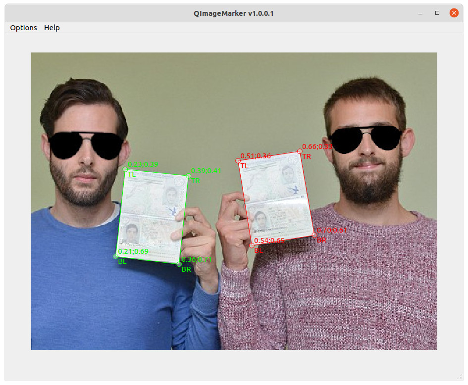

# QImageMarker

As simple as possible Qt+Opencv app for manual images markup.



## Build

TO DO...

## Installation

You only need to install qt5-default:

```bash
sudo apt install qt5-default -y
```

## Run

```bash
cd QImageMarker && \
export LD_LIBRARY_PATH=${LD_LIBRARY_PATH}:${PWD} && \
./QImageMarker
```  

---
Alex A. Taranov


